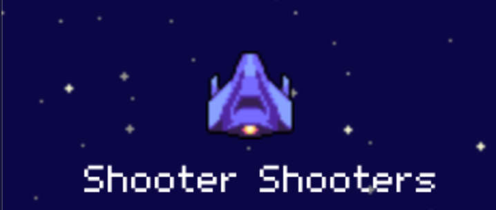
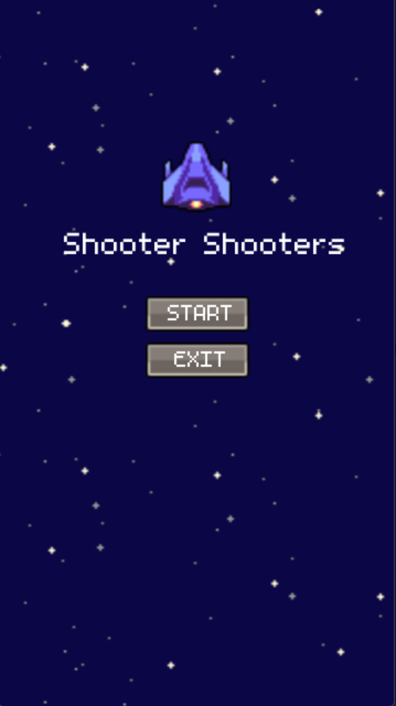
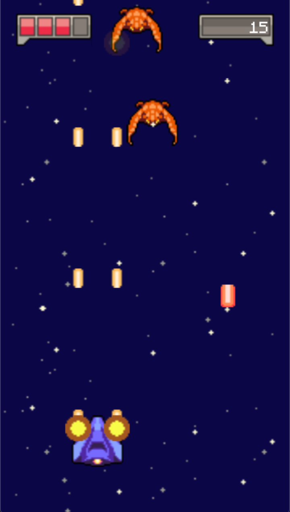

# Shooter Shooters

  

> **Shoot 'em all, reach your highest point!'**

**Part of Game Development (CSCE604121) 1-Week Mid-Test Game Jam**

Feel the real taste of Rocky's space adventure, with aliens and monsters along their way. Shoot as many monsters as possible and protect Rocky's spaceship by dodging their bullets! Remember that you only have 4 shields for the entire adventure.

Shooter Shooters is an **endless adventure shooter game** built for PC (Windows and macOS). This game used mouse/touchpad for player's control. Player should protect the spaceship by dodging alien's ship bullets. This can be done by navigating left and right according to mouse/touchpad cursor position. Bullets are fired automatically, and used to destroy alien's ship by aiming it to them.

## Screenshots

  
   

## Stacks Used

This game is built with **Godot Engine 3**. You can learn more [here](https://godotengine.org/)

## How to Get the Game

- From **releases** page of this GitHub repository. Versions updated regularly.
- From my **itch.io** page of this game, you can access it [here](https://izznfkhrlislm.itch.io/shooter-shooters).

## Credits

Credit goes to **Angega Studio's** [Patreon page](https://www.patreon.com/posts/14292162) and [YouTube channel](https://www.youtube.com/channel/UChv-gaPlKNROf6iMDhxIpUA) for providing online crash courses and free assets.
